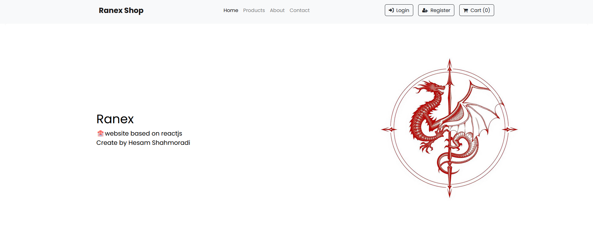

<h2>Ranex Template</h2>
<p>🏩A store website built with ReactJS, HTML, and CSS, adhering to all coding principles and incorporating distinctive features.</p>

## Getting Started

Install the template packages via the code below:

```bash
npm install
```

And then run the project with the following code:

```bash
npm start
```

<br>

<p>💪This website features a straightforward yet highly functional homepage, designed for efficiency and ease of use:</p>

<br>
<p>In this section of the main page, the latest posts are displayed, providing users with up-to-date content:</p>

<br>
<p>🌝In this section, you can view comprehensive product details, including the name, price, and description:</p>

<br>
<p>This section of the shopping cart displays all added products, allowing users to review and modify their selections as needed:</p>

<br>
<p>Finally, I would be delighted if you could rate the project❤️</p>
